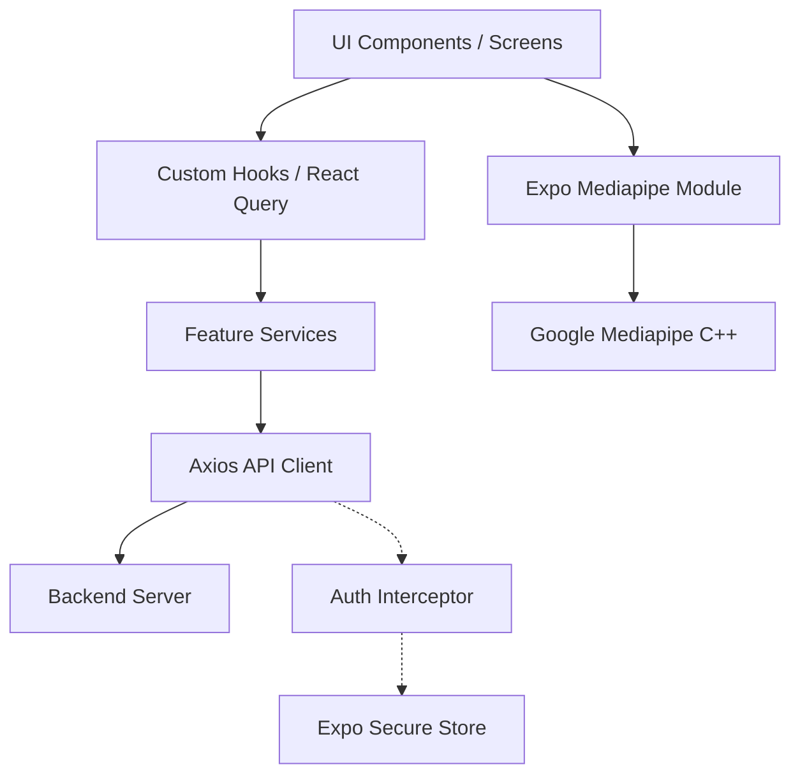

# Wasla - Mobile Application Documentation

## Table of Contents
1. [Project Overview](#1-project-overview)
2. [Features](#2-features)
3. [Tech Stack](#3-tech-stack)
4. [Project Structure](#4-project-structure)
5. [Application Architecture](#5-application-architecture)
6. [Navigation Flow](#6-navigation-flow)
7. [Screen Documentation](#7-screen-documentation)
8. [MediaCameraView Documentation](#8-mediacameraview-documentation)
9. [AI Translation Flow](#9-ai-translation-flow)
10. [API Layer](#10-api-layer)
11. [State Management](#11-state-management)
12. [Reusable Components](#12-reusable-components)
13. [Custom Hooks](#13-custom-hooks)
14. [Services Layer](#14-services-layer)
15. [Assets](#15-assets)
16. [Localization](#16-localization)
17. [Error Handling](#17-error-handling)
18. [Performance](#18-performance)
19. [Security](#19-security)
20. [Environment Variables](#20-environment-variables)
21. [Installation](#21-installation)
22. [Development Guidelines](#22-development-guidelines)
23. [Troubleshooting](#23-troubleshooting)
24. [Future Improvements](#24-future-improvements)
25. [Conclusion](#25-conclusion)

---

## 1. Project Overview

**Wasla** is a React Native mobile application built with Expo, designed to break communication barriers by translating sign language into readable text and recognizing facial emotions in real-time. 

**Purpose:** To empower individuals with speech and hearing impairments by providing a seamless, real-time sign language translation tool that bridges the gap between them and the rest of the world.

**Target Users:** 
- Deaf and hard-of-hearing individuals.
- Friends, family members, and colleagues communicating with sign language users.
- Anyone learning sign language.

**Main Features:** Real-time sign language detection, facial emotion recognition, favorite words management, bilingual support (English/Arabic), and user authentication.

**Accessibility Goals:** Ensure an intuitive, highly accessible UI with high contrast, readable typography, and RTL (Right-to-Left) support for Arabic users.

**User Experience Philosophy:** The app prioritizes speed and reliability. By running complex AI models locally on the device (via Mediapipe), users experience zero-latency translations, essential for natural, uninterrupted communication.

---

## 2. Features

### Authentication
- **Purpose:** Secure user accounts to save preferences, favorites, and profile details.
- **User Flow:** Splash Screen -> Onboarding -> Login/Signup -> OTP Verification -> Home.
- **Technical Implementation:** Handled via Axios API calls, token persistence using `expo-secure-store`, and automatic token refreshing via Axios interceptors. Google Sign-In is also integrated.

### Camera Translation & Live Sign Recognition
- **Purpose:** Real-time translation of hand gestures to text.
- **User Flow:** User navigates to the Camera Tab -> Grants permissions -> Performs sign language -> App displays translated word/phrase on the screen.
- **Technical Implementation:** Utilizes a custom native Expo module (`expo-mediapipe`) wrapping Google's Mediapipe to process frames and return recognized signs and landmarks natively without network latency.

### Emotion Recognition
- **Purpose:** Enhances communication by providing the emotional context of the user (e.g., Happy, Sad, Angry).
- **User Flow:** Concurrent with sign language recognition, a UI box highlights the user's face and displays the detected emotion.
- **Technical Implementation:** Also processed natively via the `expo-mediapipe` module, emitting `onEmotionDetected` events to the React Native thread.

### Favorite Words
- **Purpose:** Allows users to save frequently used signs/words for quick access.
- **User Flow:** User clicks the "heart" icon on a translated word -> Word is saved to the Favorites tab.
- **Technical Implementation:** Managed via backend APIs and fetched using React Query, displayed in a dedicated tab.

### Profile & Settings
- **Purpose:** Manage user account, password, and preferences.
- **User Flow:** Profile Tab -> Edit Profile / Change Password / Language Settings.
- **Technical Implementation:** Forms built with `react-hook-form` and validated using `zod`.

### Language Switching & Localization
- **Purpose:** Full bilingual support for English and Arabic.
- **User Flow:** User changes language in Settings -> App instantly updates text and layout direction.
- **Technical Implementation:** Managed by `i18next` and `react-i18next`. RTL layout is dynamically applied when Arabic is selected.

---

## 3. Tech Stack

### Core
* **React Native:** Core framework for building cross-platform mobile apps.
* **Expo:** Simplifies React Native development, builds, and native module integration.
* **TypeScript:** Ensures type safety and reduces runtime errors.

### Navigation
* **Expo Router:** File-based routing providing deep linking and a web-like navigation experience.

### State Management
* **React Query (@tanstack/react-query):** Used for managing, caching, and synchronizing server state (API responses).
* **React Context / Component State:** Used for local, ephemeral UI state management.

### Networking
* **Axios:** Robust HTTP client for handling API requests, interceptors, and token refresh logic.

### Forms
* **React Hook Form & Zod:** For performant form state management and strict schema-based validation.

### UI & Styling
* **NativeWind:** Tailwind CSS for React Native, allowing rapid, utility-based UI styling.
* **Expo Vector Icons:** Extensive icon library.
* **Reanimated & Gesture Handler:** For fluid, native-driven animations and gesture interactions.
* **Gorhom Bottom Sheet:** For advanced, native-feeling bottom sheet modals.

### Storage
* **AsyncStorage:** For non-sensitive app preferences.
* **SecureStore (`expo-secure-store`):** For encrypting and storing sensitive JWT access and refresh tokens.

### Camera & AI
* **expo-mediapipe (Custom Module):** A bespoke native module built for this app that integrates Google's Mediapipe C++ library directly into the camera preview to process frames natively.

---

## 4. Project Structure

The project follows a **Feature-Sliced Design** approach to keep related code co-located.

```text
src/
├── app/               # Expo Router file-based routing definition
├── components/        # Global reusable UI components (Buttons, Headers, Tabs)
├── constants/         # App-wide constants, theme colors, config
├── features/          # Feature modules containing domain-specific logic
│   ├── auth/          # Login, Signup, OTP, Password Reset
│   ├── camera/        # Camera view, sign language detection UI
│   ├── favourite-words/ # Favorites list and management
│   ├── home/          # Main dashboard
│   ├── onboarding/    # First-time user experience
│   └── profile/       # User profile and settings
├── hooks/             # Global custom React hooks
├── i18n/              # Localization files (en.json, ar.json) and config
├── services/          # Global API and utility services (Axios, Storage, Notifications)
└── utils/             # Helper functions and utilities
```

**Responsibility:** By grouping files by feature (e.g., `src/features/camera/screens`, `.../components`), the codebase remains highly scalable and maintainable. Global utilities reside outside the `features` folder.

---

## 5. Application Architecture

The application implements a **Feature-based architecture** combined with a robust **Service Layer**.

* **Feature Modules:** Each feature encapsulates its own screens, components, hooks, and services.
* **Service Layer:** Handles all external communication (APIs, Local Storage).
* **API Layer:** A central Axios instance manages authentication interceptors globally.



---

## 6. Navigation Flow

Navigation is handled by **Expo Router**, utilizing a file-based structure inside the `src/app` directory.

**Flow:**
```text
Splash / Entry Point
  ↓
(Check Auth State)
  ├─> Not Authenticated
  │     └─> Onboarding -> Login -> Signup -> Verify OTP
  │
  └─> Authenticated
        └─> (app) Tab Navigator
              ├─> Home Tab
              ├─> Camera Tab (ScanScreen)
              ├─> Favorites Tab (FavouriteWordsScreen)
              └─> Profile Tab
                    └─> Edit Profile / Change Password
```

Internal navigation works via the `router.push()`, `router.replace()`, and `<Link>` components provided by Expo Router. Deep linking is automatically supported based on the folder structure.

---

## 7. Screen Documentation

### ScanScreen (`src/features/camera/screens/ScanScreen.tsx`)
- **Purpose:** The core feature screen where live sign language and emotion detection occurs.
- **UI Description:** Full-screen camera view with a translucent overlay containing a close button, flash toggle, detected emotion badge, and a bottom sheet displaying the translated word.
- **State:** `isReady` (camera initialization), `landmarks` (detected hands/face), `signResult` (current translated text), `emotion` (current detected facial emotion).
- **Hooks:** `useTranslation`, `useState`, `useSafeAreaInsets`.
- **API Calls:** None directly on this screen; processing is completely local.
- **Business Logic:** Initializes the native camera, handles Android permissions, receives events from the native thread (`onSignDetected`, `onEmotionDetected`), and maps them to the UI state.

*(Additional screens like Login, Signup, Profile follow a similar pattern, leveraging `react-hook-form` for state and Axios services for APIs).*

---

## 8. MediaCameraView Documentation

The `MediapipeCameraView` is a custom native component located in `modules/src/modules/mediapipe`.

### Purpose
It replaces standard camera libraries (like `expo-camera`) to tightly couple the camera frame pipeline with Google's Mediapipe SDK. This allows for real-time inference without the heavy performance overhead of passing frames between Native and JS threads.

### Responsibilities
* Camera preview rendering.
* Frame capture and direct memory passing to Mediapipe.
* Real-time Hand tracking and Face mesh mapping.
* Sign language classification.
* Emotion classification.

### Props
* `style`: Standard React Native ViewStyle.
* `facing`: `'front' | 'back'`.
* `onReady`: Fired when the camera has initialized.
* `onError`: Fired on camera or pipeline failures.
* `onLandmarks`: Fired continuously with X,Y,Z coordinates for hands and face.
* `onSignDetected`: Fired when a sign gesture is confidently recognized. Returns `{ label, confidence, committed }`.
* `onEmotionDetected`: Fired when an emotion is recognized. Returns `{ emotion, confidence, timestamp }`.

### Lifecycle
1. **Mount:** The native module initializes the Mediapipe graphs and loads TFLite models (`preloadModels`).
2. **Permission Granted:** Camera starts feeding frames into the Mediapipe graph natively.
3. **Frame Capture:** Done entirely in C++/Java/Kotlin/Swift. JS thread is not blocked.
4. **Translation:** When Mediapipe recognizes a pattern, an event is serialized and sent to the JS thread.
5. **Unmount:** Camera is released, and Mediapipe resources are freed to prevent memory leaks.

### Performance Optimizations
* **Zero-copy frame processing:** Frames are analyzed natively; they are not encoded to base64 or sent to the JS thread.
* **Event Throttling:** The native module throttles `onLandmarks` and `onSignDetected` events to prevent overwhelming the React Native bridge.

---

## 9. AI Translation Flow

Unlike traditional apps that send images to a backend, Wasla is optimized for **offline, real-time edge computing**.

**Flow:**
1. **User opens camera:** `ScanScreen` mounts `MediapipeCameraView`.
2. **Frame captured (Native):** The native camera module captures a raw video frame.
3. **Edge Processing:** The frame is passed directly into the Mediapipe C++ graph loaded on the device.
4. **Inference:** Hand landmarks are extracted and passed through the local Sign Language TFLite classification model.
5. **Translation Returned:** The native module emits an `onSignDetected` event across the React Native Bridge.
6. **UI Updates:** React Native receives the payload `{"label": "Hello", "confidence": 0.95}` and updates the `signResult` state, immediately reflecting on the screen.

*(Note: There is no backend AI API request for the live translation, guaranteeing privacy and 0ms network latency).*

---

## 10. API Layer

Located in `src/services/api.ts`.

- **Axios Instance:** Pre-configured with the base URL (`https://api.vocalaid.app`).
- **Request Interceptor:** Automatically retrieves the `access_token` from SecureStore and attaches it as a `Bearer` token. Also attaches the current `Accept-Language` header for backend localization.
- **Response Interceptor (Refresh Token Logic):**
  - Intercepts `401 Unauthorized` responses.
  - Pauses all incoming requests (`failedQueue`).
  - Attempts to refresh the token via `/api/v1/auth/refresh-token`.
  - If successful, updates SecureStore and replays all queued requests.
  - If failed, logs the user out and redirects to the Login screen.

---

## 11. State Management

Wasla primarily uses **React Query** for remote state and **React Context / Component State** for local state. 

*(Note: While Zustand is a popular choice, the current architecture relies entirely on React Query's robust caching mechanism, negating the need for a global Zustand store for server data).*

### React Query Usage
- **Purpose:** Handles fetching, caching, synchronizing, and updating server state.
- **Optimistic Updates:** Used in features like "Favorite Words" where the UI updates immediately when a user hearts a word, before the API confirms the success, ensuring a snappy UX.
- **Cache Invalidation:** When a user updates their profile, `queryClient.invalidateQueries` is called to force a background refetch of the user data.

---

## 12. Reusable Components

Located in `src/components/`.

* **CustomHeader (`CustomHeader.tsx`):** A standardized top navigation header supporting titles, back buttons, and dynamic safe area insets.
* **CustomButton (`CustomButton.tsx`):** A highly customizable button with loading states, various variants (primary, outline), and consistent styling.
* **FloatingTabBar (`FloatingTabBar.tsx`):** A custom animated bottom tab bar for the main app navigation, built with Reanimated.
* **OfflineScreen (`OfflineScreen.tsx`):** Automatically displays when the `@react-native-community/netinfo` detects no internet connection.

---

## 13. Custom Hooks

* **`useCurrentUser` (`src/hooks/useCurrentUser.tsx`):**
  - **Input:** None.
  - **Output:** Returns `{ user, isLoading, isError, refetch }`.
  - **Internal Logic:** Wraps a React Query `useQuery` hook that calls the `/profile` endpoint. 
  - **Use Cases:** Used globally across Profile, Home, and Settings screens to instantly access the authenticated user's data.

---

## 14. Services Layer

Located in `src/services/`.

* **API Service (`api.ts`):** Global Axios configuration.
* **StorageService (`storage.service.ts`):** Wrapper around `AsyncStorage` and `SecureStore` providing consistent `getItem`, `setItem`, `removeItem` interfaces.
* **TokenService (`token.service.ts`):** Utilities specific to token manipulation and decoding.
* **NotificationsService (`notifications.service.ts`):** Handles Expo Push Notification registration, permission requesting, and token retrieval.
* **DeviceService (`device.service.ts`):** Registers device tokens with the backend for targeted push notifications.

---

## 15. Assets

* **Images & SVGs:** Located in `assets/`. Handled optimally using `expo-image` for aggressive caching and fast rendering.
* **Fonts:** `cairo` font is loaded globally for seamless Arabic typography.
* **Localization Files:** `src/i18n/en.json` and `src/i18n/ar.json`. Keys are structured hierarchically (e.g., `"auth.login.title"`).

---

## 16. Localization

Handled by `i18next`.

- **Language Switching:** The app dynamically switches between English (`en`) and Arabic (`ar`).
- **RTL Support:** NativeWind and React Native dynamically flip layouts (`flex-row` reverses) when the `i18n.language` is set to Arabic, ensuring native RTL behavior.
- **Translation Files:** JSON key-value pairs ensure type safety and easy management.

---

## 17. Error Handling

- **API Errors:** Centralized in Axios. UI displays toast notifications (via `react-native-toast-message`) for structured backend errors.
- **Camera Errors:** Handled via the `onError` prop in `MediapipeCameraView`. Fallback UI advises the user if the camera fails to initialize.
- **Network Errors:** Global `OfflineScreen` blocks interactions requiring network when disconnected.

---

## 18. Performance

- **Edge AI:** Processing ML models locally avoids massive network overhead and latency.
- **expo-image:** Used over standard `<Image>` for memory-efficient image caching and decoding.
- **Reanimated:** Animations run on the UI thread, ensuring 60fps even when the JS thread is busy with business logic.
- **React Query Caching:** Prevents redundant network requests for unchanged data (e.g., Favorites list, Profile data).

---

## 19. Security

- **Token Storage:** JWTs are NEVER stored in plain text. They reside in `expo-secure-store` which utilizes iOS Keychain and Android Keystore.
- **Protected Routes:** Expo Router `_layout.tsx` files contain logic to restrict access to the `/(app)` group unless a valid token is present in storage.
- **API Security:** All backend communications are encrypted over HTTPS.

---

## 20. Environment Variables

Environment variables are stored in a `.env` file (not committed to Git).

* `EXPO_PUBLIC_GOOGLE_WEB_CLIENT_ID`: Used for Google OAuth login on web.
* `EXPO_PUBLIC_GOOGLE_IOS_CLIENT_ID`: Used for Google OAuth login on iOS.
* `EXPO_PUBLIC_GOOGLE_ANDROID_CLIENT_ID`: Used for Google OAuth login on Android.
*(Note: The API base URL is currently hardcoded but should be migrated to `EXPO_PUBLIC_API_URL`)*.

---

## 21. Installation

**Prerequisites:** Node.js (v18+), pnpm, Expo CLI, Android Studio / Xcode.

1. **Clone repository:**
   ```bash
   git clone <repository-url>
   cd gp-mobile
   ```
2. **Install dependencies:**
   ```bash
   pnpm install
   ```
3. **Configure environment variables:**
   Create a `.env` file in the root directory and populate the required keys.
4. **Start Development Server:**
   ```bash
   npx expo start
   ```
5. **Run on Android/iOS (Development Build required for Native Modules):**
   ```bash
   npx expo run:android
   # OR
   npx expo run:ios
   ```

---

## 22. Development Guidelines

* **Code Style:** Prettier and ESLint are configured. Always run `pnpm lint` before pushing.
* **Component Naming:** PascalCase for components (`CustomButton.tsx`).
* **Hook Naming:** camelCase prefixed with `use` (`useCurrentUser.tsx`).
* **Imports:** Use absolute imports configured via `tsconfig.json` (e.g., `import X from '@/components/X'`).
* **Styling:** Always use NativeWind (`className`) over inline `style` objects for performance and consistency.

---

## 23. Troubleshooting

* **Camera Permission Denied:** Go to App Settings on your OS and manually enable the Camera permission.
* **Metro Cache Issues:** If NativeWind classes aren't updating or you see stale code:
  ```bash
  npx expo start -c
  ```
* **Native Module Errors (`Mediapipe module not found`):** Because the app uses a custom native module, it **cannot** be run in the standard Expo Go app. You must compile a custom development build using `npx expo run:android`.
* **API Connection Errors:** Ensure the `baseURL` in `src/services/api.ts` is pointing to a reachable IP/URL if testing locally.

---

## 24. Future Improvements

* **Cloud Fallback:** Implement an optional cloud-based translation API fallback if local inference confidence is too low.
* **Expanded Vocabulary:** Train and update the TFLite model to recognize a broader dictionary of signs.
* **State Management Migration:** If local client state complexity grows significantly beyond server state, introduce Zustand for robust client state management.
* **E2E Testing:** Integrate Detox for end-to-end testing of the camera and authentication flows.

---

## 25. Conclusion

**Wasla** represents a complex, highly optimized React Native architecture combining modern React paradigms (React Query, Expo Router, NativeWind) with heavy edge-computing (custom Mediapipe native integration). The feature-based folder structure ensures high maintainability, while the localized processing guarantees real-time accessibility for its users. By adhering to the patterns documented above, developers can easily extend the application with new features, languages, and ML models.
